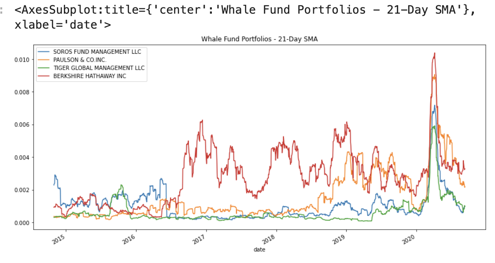

# Analyzing Portfolio Risk and Return

In Module 4 Challange we are tasked with evaluating four new investment options for inclusion in the client portfolios. Legendary fund and hedge-fund managers run all four selections. We will need to determine the fund with the most investment potential based on key risk-management metrics: **The [Daily Returns](https://www.investopedia.com/ask/answers/062215/how-do-i-calculate-my-portfolios-investment-returns-and-performance.asp "Daily Returns"), [Standard Deviations](https://www.investopedia.com/terms/s/standarddeviation.asp "Standard Deviation"), [Sharpe Ratios](https://www.investopedia.com/terms/s/sharperatio.asp "Sharpe Ratios"), and [Betas](https://www.investopedia.com/terms/b/beta.asp "Betas").**

---

## Technologies
Analyzing Portfolio Risk and Return project leverages python 3.7 with the following packages:

[Pandas](https://github.com/pandas-dev/pandas "Pandas") -
For the analysis/manipulation/plotting the data for the four fund portfolios and [S&P 500](https://en.wikipedia.org/wiki/S%26P_500 "S&P 500"). 

[NumPy](https://github.com/numpy/numpy "NumPy") -
To calculate annualized standard deviation by using the square root.

---

## Installation Guide

First install the following libraries and dependencies.

```
# conda
conda install pandas
```

```
import pandas as pd
import numpy as np
from pathlib import Path
%matplotlib inline
```


---

## Usage

**1.Analyze the Performance**
<br>
We analyze the data by using `cumprod` and `plot` functions to determine if any of the portfolios outperform the broader stock market, which the S&P 500 represents. 
```
whale_cumulative_returns = (1 + whale_daily_returns).cumprod()
```


**2.Analyze the Volatility**
<br>
Next we would analyze the volatility of each of the four fund portfolios by using visualizations such as `box` plots.
```
whale_wo_sp500 = whale_daily_returns.drop(columns= ["S&P 500"])
whale_wo_sp500.plot.box(figsize = (10,5), title= "Whale Fund Portfolios without S&P 500 Box Chart")
```


**3.Analyze the Risk**
<br>
Following we evaluate the risk profile of each portfolio by using the standard deviation and the beta.
 ```
annualized_standard_deviation = standard_deviation * np.sqrt(252)
annualized_standard_deviation.sort_values()
```

 


**4.Analyze the Risk-Return Profile**
<br>
To determine the overall risk of an asset or portfolio we would use risk-return profile metrics. For this reason, we need to consider the Sharpe ratios for each portfolio.
```
sharpe_ratios = average_annual_return/annualized_standard_deviation
sharpe_ratios.sort_values()
```


**5.Diversify the Portfolio**
<br>
We need to evaluate how the portfolios react relative to the broader market. Based on our analysis we pick two portfolios and compare them to each other based on variance, covariance, and rolling beta to find a winner.
```
bh_rolling_60_beta = bh_rolling_60_covariance/snp_rolling_60_variance
tgm_rolling_60_beta = tgm_rolling_60_covariance/snp_rolling_60_variance
```
---

## Contributors

* Brought to you by Olga Koryachek.
* Email: olgakoryachek@live.com
* [LinkedIn](https://www.linkedin.com/in/olga-koryachek-a74b1877/?msgOverlay=true "LinkedIn")


---

## License

Licensed under the [MIT License](https://choosealicense.com/licenses/mit/)


